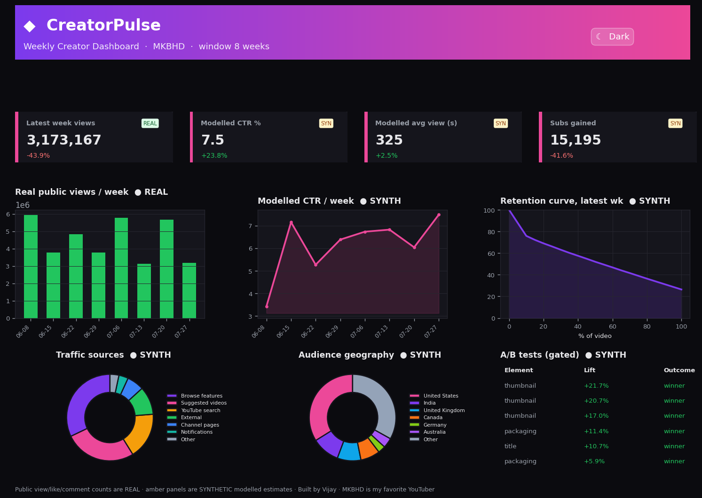
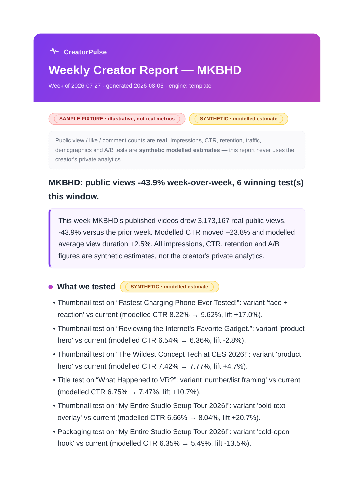

# CreatorPulse — Weekly Creator Report Pipeline

A lightweight, re-runnable pipeline that turns a YouTube channel's **real public
data** into a plain-English weekly creator report an account lead can put
straight in front of a creator. Built for **MKBHD** out of the box, works for any
channel via config.

> Built by Vijay. MKBHD is my favorite YouTuber, so his channel (`@mkbhd`) is the
> default target throughout — swap `channel.handle` in `config.yaml` for any other.

It does the full loop: **ingest → synthesize → store → analyze → write (LLM) →
QA (LLM) → render (report + dashboard)** — with a hard, visible wall between real
public data and a clearly-labeled synthetic analytics layer.

---

## Showcase

**Interactive dashboard** — dark/light toggle, live charts, KPI count-ups, scroll animations:



**Weekly creator report** — plain-English, creator-facing, exports to HTML + PDF:



> Green = **real public data**; amber = **synthetic modelled estimates**. The
> boundary is visible in every view. The images above are generated from the
> sample fixture; run the pipeline on your machine for live MKBHD data.

---

## Run it (one command)

```bash
pip install -r requirements.txt
python run.py
```

That's it. Outputs land in `reports/` (HTML + PDF) and `dashboard/index.html`
(open in any browser — no server needed).

### Useful flags

| Command | What it does |
|---|---|
| `python run.py` | Full pipeline; pulls **live** public data via yt-dlp if available |
| `python run.py --no-llm` | Skips the API entirely; deterministic narrative (nothing to configure) |
| `python run.py --fixture` | Forces the bundled offline sample dataset (CI / demos) |
| `python run.py --channel @mkbhd` | Point it at any channel handle |

### Optional configuration

- **Live public pull:** `pip install yt-dlp` (in requirements). No API key needed.
  Alternatively set `YOUTUBE_API_KEY` to use the YouTube Data API.
- **LLM report + QA:** put your key in a local `.env` (git-ignored):
  ```
  ANTHROPIC_API_KEY=sk-ant-...
  ```
  The report/QA calls use only the Python stdlib — no SDK. Without a key (or with
  `--no-llm`), a deterministic template produces the same report structure.
- **PDF export:** `pip install weasyprint` (optional). HTML is always produced.

---

## Architecture

```
run.py                    one-command orchestrator
config.yaml               channel + synthetic calibration knobs (all assumptions live here)
src/
  ingest.py     REAL public layer: yt-dlp → YouTube API → sample fixture (records provenance)
  synthesize.py SYNTHETIC owner-only layer: impressions, CTR, retention, traffic,
                demographics, A/B log — every row flagged is_synthetic
  store.py      SQLite: public_videos vs syn_* tables, physically separated
  analyze.py    WoW deltas, trend + anomaly detection, retention drop-off, A/B significance
  themes.py     optional: TF-IDF k-means of titles vs real views (swappable for embeddings)
  report.py     LLM structured-output narrative + second-pass numeric QA (stdlib urllib)
  render.py     creator-facing HTML/PDF report + static Chart.js dashboard
data/           creatorpulse.db + raw/synthetic dumps (git-ignored, rebuilt each run)
reports/        generated weekly report (HTML + PDF)
dashboard/      static index.html
docs/DECISIONS.md   1-page writeup of key decisions + calibration
```

Data flow:

```
 [yt-dlp / API / fixture]         [config.yaml calibration]
        │ real public                    │
        ▼                                ▼
   ingest.py ───────────────────►  synthesize.py   (labeled synthetic)
        │                                │
        └──────────────┬─────────────────┘
                       ▼
                   store.py  (SQLite: public_videos | syn_*)
                       ▼
                  analyze.py  (deltas, trends, anomalies, retention, A/B tests)
                       ▼
     report.py  ── Claude structured output ──► narrative ──► Claude QA pass
                       ▼
     render.py  ──►  reports/*.html + *.pdf   and   dashboard/index.html
```

---

## The real-vs-synthetic design (the important part)

A creator's **public** data (titles, publish dates, views, likes, comments,
durations, thumbnails) is available to anyone. Their **owner-only** analytics
(impressions, CTR, average view duration, retention curves, traffic sources,
audience demographics, A/B test results) live inside YouTube Studio and **cannot
be accessed publicly**. This pipeline **never implies access to private
analytics.**

So it keeps two domains apart, everywhere:

- **Real public layer** — pulled live (`ingest.py`). Every row carries a `source`
  (`yt-dlp` / `youtube-api` / `sample-fixture`). Marked **REAL** in green.
- **Synthetic owner-only layer** — generated (`synthesize.py`), calibrated to
  publicly-plausible ranges, every row flagged `is_synthetic=True`. Marked
  **SYNTHETIC** in amber in the report, the dashboard, and the code.

The two never merge into one "blended" number, with one documented exception:
synthetic weekly **impressions are derived from real views** (`views ≈
impressions × CTR`) so the modelled funnel stays internally consistent with what
actually happened. That link is disclosed, not hidden.

Full calibration and assumptions: [`docs/DECISIONS.md`](docs/DECISIONS.md).

> **On the bundled sample:** this repo ships a small offline fixture so the demo
> runs with zero setup. Its public engagement counts are **illustrative, not real
> MKBHD numbers**, and are labeled `sample-fixture` end to end. Run `python
> run.py` on a networked machine with yt-dlp and the real pull replaces it.

---

## What the weekly report covers

Plain-English, no jargon, built for an account lead to read aloud:
headline · summary · what we tested · what worked · what to do next · flagged
trends · anomalies · top public videos · **automated QA verdict** on the numbers.

The report is written by a Claude **structured-output** call, then a **second
Claude pass QAs every number** in the draft against the source data and stamps a
verdict (pass / pass-with-notes / fail) onto the report.
